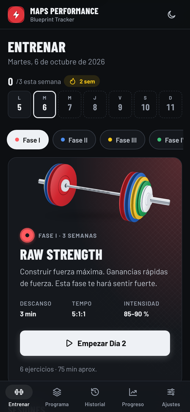

# MAPS Performance Tracker

Registro de entrenamientos para el programa **MAPS Performance Blueprint**: es una PWA instalable que funciona sin conexión, no necesita cuentas y guarda tus datos solo en tu dispositivo.



## Qué hace

| Pantalla | Para qué sirve |
|---|---|
| **Entrenar** | Muestra la fase activa con su barra 3D y sugiere la siguiente sesión de la rotación con un solo botón para empezar. Incluye la tira de la semana con tus sesiones, la racha y la meta. |
| **Sesión** | Registra cada set en dos toques: el set anterior aparece como referencia y, al marcar ✓, los campos vacíos toman esos valores y arranca el descanso. Muestra el progreso de los sets y guarda el borrador solo, aunque cierres la app. |
| **Programa** | Presenta las 4 fases y la movilidad con sus parámetros (tempo, descanso, intensidad). Permite programar fechas y ver las próximas sesiones. |
| **Historial** | Agrupa las sesiones por mes, con búsqueda por ejercicio o nota y filtro por fase. Cada sesión muestra su detalle por set y se puede eliminar con opción de deshacer. |
| **Progreso** | Reúne los KPIs (sesiones, meta semanal, racha y volumen de 30 días), la gráfica de 1RM estimado / peso máximo / volumen por ejercicio, el volumen semanal de 12 semanas y los récords personales. Cada gráfica tiene vista de tabla. |
| **Ajustes** | Permite elegir tema (oscuro, claro o sistema), unidades (kg/lb, con conversión de todo el historial), meta semanal, descanso por fase, sonido y vibración. También exporta a JSON o CSV, importa respaldos (también los de la versión anterior) y borra los datos. |

Otras funciones:

- **Temporizador de descanso preciso:** se basa en marcas de tiempo, así que no se atrasa con la pantalla bloqueada. Tiene botones de +15 y −15 s, cambia de color en los últimos 10 s y avisa con sonido y vibración.
- **Pantalla siempre encendida** durante la sesión (Wake Lock).
- **Detección de récords** al guardar, por peso máximo o por 1RM estimado (fórmula de Epley), con resumen y celebración.
- **Migración automática** de los datos de la versión 1 (`maps_logs`, `workout_schedule` y `theme`). Las claves antiguas se conservan como respaldo.

## Diseño

- **Concepto "acero calibrado".** Cada fase lleva el color de un disco calibrado IPF: Fase I rojo (25 kg), II azul (20 kg), III amarillo (15 kg), IV verde (10 kg) y movilidad en gris tiza. Los neutros son de acero frío y las acciones van en tinta sólida, para que el color solo comunique significado.
- **Tipografía:** Barlow Condensed para títulos y cifras (estilo marcador de gimnasio) y Barlow para el texto, ambas alojadas en el proyecto (licencia SIL OFL) para que funcionen offline. Las cifras usan números tabulares para que no "bailen" al cambiar 80 por 82.5.
- **Movimiento con propósito:**
  - Barra olímpica 3D en CSS que se carga disco por disco y se inclina con el puntero.
  - Transiciones entre pantallas con View Transitions API.
  - Tarjetas con inclinación 3D.
  - Check de set con resorte y onda expansiva.
  - Gráficas que se dibujan.
  - Contadores animados.
  - Todo se desactiva con `prefers-reduced-motion`.
- **Accesibilidad:**
  - Cumple WCAG 2.2 AA (verificado con axe en ambos temas).
  - Objetivos táctiles de 44 px como mínimo.
  - Navegación completa con teclado, también en las gráficas (←/→/Inicio/Fin).
  - Etiquetas ARIA en cada input de set.
  - Tabla equivalente para cada gráfica.
- **Paleta de datos** validada para daltonismo: una sola serie en azul de disco, con cuadrícula en línea fina.

## Estructura

```
index.html               shell de la app, sprite de iconos SVG
manifest.json            manifiesto PWA (íconos PNG + maskable, accesos directos)
service-worker.js        precache del shell; red primero para HTML, stale-while-revalidate para assets
assets/css/app.css       sistema de diseño: tokens claro/oscuro, componentes, motion
assets/js/program.js     definición del programa y links de video  ← edita aquí
assets/js/core.js        lógica pura: fechas, unidades, migración, estadísticas, récords, import/export
assets/js/charts.js      gráficas SVG sin dependencias (línea + columnas, tooltip, teclado)
assets/js/app.js         interfaz: router, vistas, registrador, temporizador, efectos
assets/fonts/            Barlow / Barlow Condensed (woff2, SIL OFL)
assets/icons/            icon.svg + PNG generados (npm run icons)
tests/unit/              pruebas de core.js (node:test)
tests/e2e/               pruebas de navegador (Playwright + axe-core)
```

No necesita build: es HTML, CSS y JavaScript plano. Abre `index.html` directamente o sírvelo con cualquier servidor estático.

## Desarrollo

```bash
npm install          # solo para las pruebas (Playwright + axe-core)
npm start            # http://localhost:5173
npm test             # pruebas unitarias + e2e
npm run test:unit    # rápido, sin navegador
npm run icons        # regenera los PNG desde assets/icons/icon.svg
```

Las pruebas e2e cubren:

- La migración de datos v1, incluido el bug de zona horaria de las sesiones nocturnas en UTC−6.
- El registro completo de una sesión, el temporizador y el borrador que sobrevive a una recarga.
- Movilidad, récords, unidades, export/import, historial y programación de fechas.
- Accesibilidad con axe en todas las vistas y ambos temas.
- Que no haya desbordamiento horizontal entre 320 y 1440 px.
- El funcionamiento offline con el service worker.

`SCREENSHOTS=docs/screenshots npm run test:e2e` regenera las capturas.

## Personalizar

- **Links de video:** edita `exerciseLinks` en `assets/js/program.js`. Si un ejercicio no tiene link, no muestra el botón de demo.
- **Ejercicios y fases:** se definen en `phases` dentro del mismo archivo. Los nombres de ejercicio son la llave del historial; si renombras uno, sus registros anteriores quedan con el nombre viejo.
- **Al publicar una nueva versión,** sube `VERSION` en `service-worker.js` para que los usuarios reciban la actualización.

## Datos

Todo vive en `localStorage` del navegador:

| Clave | Contenido |
|---|---|
| `maps.v2` | sesiones, fechas programadas y ajustes |
| `maps.v2.draft` | la sesión en curso, sin guardar todavía |
| `maps_logs`, `workout_schedule`, `theme` | datos de la versión 1, conservados como respaldo |

Si borras los datos del navegador, pierdes el historial. Usa **Ajustes → Exportar respaldo** con regularidad.
